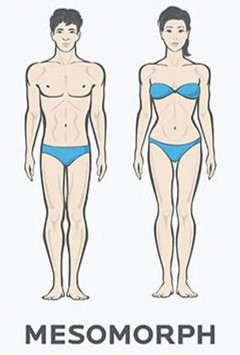

    

  <h3 align="center">🏋️‍♂️ Assistente de Personal Trainer - Gerador de Treino Ideal</h3>
Este projeto é um desafio de Prompt Engineering, com o objetivo de criar um prompt que ajude a montar o treino ideal para cada combinação de fatores, como biotipo corporal, disponibilidade de tempo e preferências de exercícios. O assistente de personal trainer gerado por esse prompt será capaz de personalizar os treinos de acordo com as características e necessidades do usuário.

## 📋 Índice

- [📋 Índice](#-índice)
- [📝 Introdução](#-introdução)
- [💪 Biotipos Corporais](#-biotipos-corporais)
- [🏋️ Onde vão ser realizados os treinos](#-Onde-vão-ser-realizados-os-treinos)
- [📅 Disponibilidade de tempo para treino](#️-Disponibilidade-de-tempo-para-treino)
- [🧮 Saber o IMC](#️-Saber-o-IMC)
- [🤔 Objetivo do Aluno](#️-Objetivo-do-Aluno)
- [🛠️ Regras de negócio](#️-regras-de-negócio)
- [🔗 Contato](#️-Contato)

---

## 📝 Introdução

Este projeto visa criar um assistente de personal trainer automatizado que ajuda a gerar treinos personalizados. O usuário fornecerá informações como o biotipo corporal, a quantidade de dias disponíveis para treinar na semana e o tipo de exercício preferido, e o assistente gerará um plano de treino ideal com base nessas informações.

---

## 💪 Biotipos Corporais

A primeira regra para personalizar o treino é determinar o biotipo corporal do usuário. Existem três biotipos principais:

<table>
  <tr>
    <th>Imagem</th>
    <th>Biotipo</th>
    <th>Descrição</th>
  </tr>
  <tr>
    <td style="text-align: center;">
      
    </td>
    <td><strong>Ectomorfo</strong></td>
    <td>Corpo mais magro, difícil ganhar peso e massa muscular.</td>
  </tr>
  <tr>
    <td style="text-align: center;">
      
    </td>
    <td><strong>Mesomorfo</strong></td>
    <td>Corpo naturalmente musculoso, facilidade para ganhar massa muscular e perder gordura.</td>
  </tr>
  <tr>
    <td style="text-align: center;">
      
    </td>
    <td><strong>Endomorfo</strong></td>
    <td>Corpo com tendência a acumular gordura, maior dificuldade em perder peso.</td>
  </tr>
</table>

> **Nota:** Escolha o biotipo que mais se aproxima do seu corpo atual para que o treino seja mais eficiente.

---

## 🏋️ Onde vão ser realizados os treinos

Saber onde os treinos serão realizados é essencial para criar um plano de treino eficaz. As facilidades de uma academia são diferentes das que temos em casa, por exemplo. Com essa informação, podemos ajustar os exercícios e equipamentos disponíveis, garantindo que o treino se encaixe de forma eficiente no ambiente onde será praticado.

---

## 📅 Disponibilidade de tempo para treino

Saber quantos dias de treino e quanto tempo temos disponíveis por dia é fundamental para gerenciar o tempo do aluno de forma eficiente. Com essas informações, podemos estruturar o treino de maneira a maximizar o desempenho, ajustando a intensidade e a duração conforme a disponibilidade do aluno.

---

## 🧮 Saber o IMC

O IMC do aluno é relevante para fornecer uma base sobre suas necessidades. Ele ajuda a entender se o aluno está com sobrepeso, abaixo do peso, no peso ideal, entre outros aspectos, permitindo ajustar o treino de acordo com suas condições físicas.

---

## 🤔 Objetivo do Aluno

O objetivo do aluno ajuda a identificar suas necessidades e expectativas. Saber o que ele espera como resultado — como ganhar massa muscular, perder peso, melhorar no desempenho em esportes, pular mais alto, correr mais rápido, ou até melhorar para jogar basquete ou outros esportes — é essencial para criar um plano de treino personalizado e eficaz.

---

## 🛠️ Regras de negócio

1. **Identifique seu biotipo corporal** Consulte a seção de biotipos.
2. **Saiba onde vão ser realizados os treinos** Para ajustar melhor quais possíveis exercícios realizar.
3. **Determine quantos dias por semana (e tempo) você pode treinar** Para melhor ajuste no treino.
4. **Identifique o IMC do aluno** Para melhor ajuste de treino.
5. **Saiba o objetivo do aluno** Procure a informação de objetivo, pois será ideal para a criação do treino.
6. Use o prompt do assistente para gerar um plano de treino personalizado.

---

## 🔗 Contato

 🌐 📷 💻

Whatsapp: https://api.whatsapp.com/send?phone=5581982425993

📧 E-mail: j.davi2077t@gmail.com

📞 Entre em contato por meio dessas redes sociais, ou envie uma mensagem no meu perfil do GitHub. Estou sempre aberto a novas oportunidades e desafios. 
